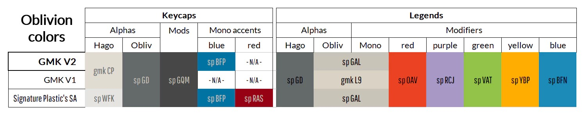

#Mechanical calculator
Description coming soon
#Oblivion colorsheme

* Designer: Oblotzky
* Profile: GMK 1-1-2-3-4-4
* ColorCodes:

| Keycaps       | SPABS colours                | Color |
| ------------- |:------------------:| -----:|
| gmk CP     | -    | - |
| sp WFK     | RGB(229, 228, 223) (#e5e4df)||
| sp GD      | RGB(99, 105, 106) (#63696a)||
| sp GQM     | RGB(70, 71, 70)   (#464746)||
| sp BFP      | RGB(0, 115, 162) (#0073a2)||
| sp RAS      | RGB(149, 0, 19) (#950013) ||
| sp GAL      | 	RGB(200, 195, 184) (#c8c3b8)         ||
| gmk L9      | -         |-|
| sp OAV      | 	RGB(234, 66, 33) (#ea4221)         ||
| sp RCJ      |	RGB(166, 152, 197) (#a698c5)||
| sp VAT      |	RGB(147, 194, 71) (#93c247)||
| sp YBP      | RGB(255, 172, 0) (#ffac00)||
| sp BFN      |	RGB(26, 138, 183) (#1a8ab7)||
